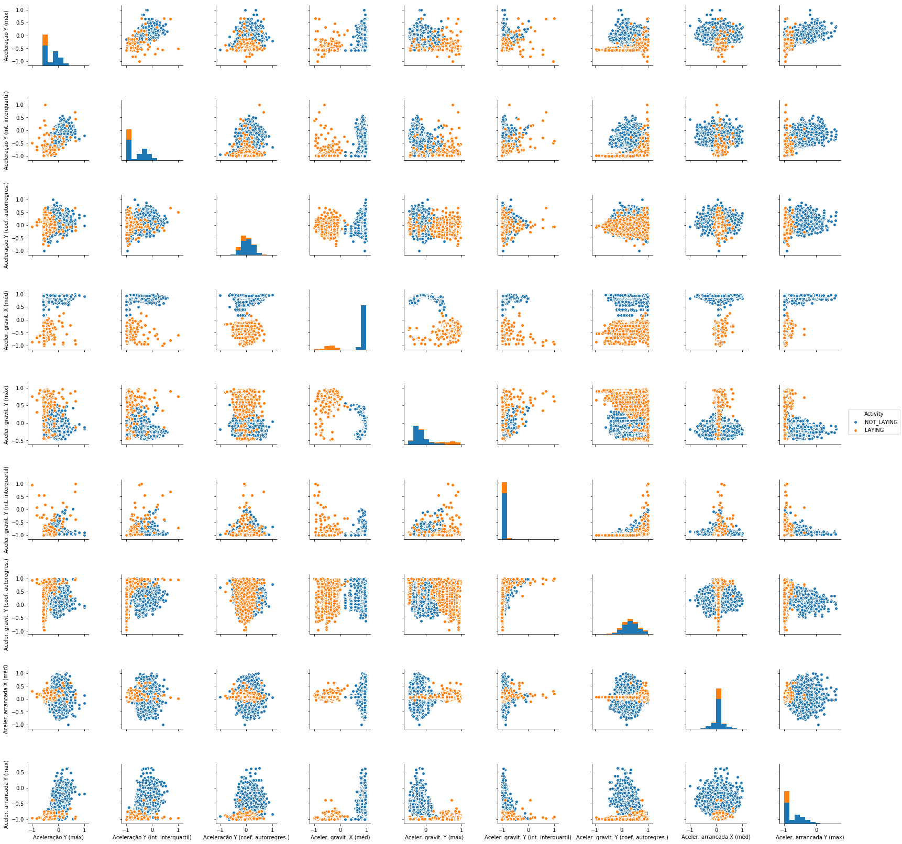
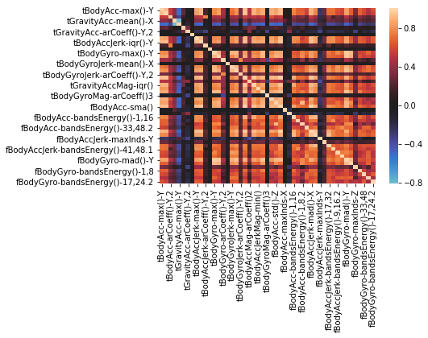
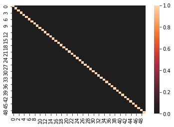

# Nanodegree Engenheiro de Machine Learning
## Projeto final - Reconhecimento de Atividades Usando Dados de Smartphone
Renato Rosafa Gavioli 
31 de dezembro de 2050

## I. Definição
_(aprox. 1-2 páginas)_

### Visão geral do projeto
Nesta seção, procure fornecer uma visão de alto nível do projeto em linguagem simples. Questões para se perguntar ao escrever esta seção:
- _Foi fornecido um resumo do projeto final, bem como o domínio do problema, a origem do projeto e o conjunto de dados ou entradas?_
- _Foram dadas informações suficientes sobre o contexto para que um leitor desinformado possa entender o domínio e a enunciação problema?_

A evolução da pirâmide etária brasileira vem apontando para um gradual envelhecimento da população. Este envelhecimento, caracterizado por um aumento na quntidade de idosos na população, é decorrente do crescente grau de urbanização do desenvolvimento econômico e humano do país [https://www.ibge.gov.br/apps/populacao/projecao/, acesso em 09.07.2018].

Idosos são frequentemente vítimas de quedas. Além dos problemas médicos, as quedas apresentam custo social, econômico e psicológico enormes, aumentando a dependência e a institucionalização. Estima-se que há uma queda para um em cada três indivíduos com mais de 65 anos e, que um em vinte daqueles que sofreram uma queda sofram uma fratura ou necessitem de internação. Dentre os mais idosos, com 80 anos e mais, 40% caem a cada ano. Dos que moram em asilos e casas de repouso, a freqüência de quedas é de 50%. A prevenção de quedas é tarefa difícil devido a variedade de fatores que as predispõem.[http://bvsms.saude.gov.br/bvs/dicas/184queda_idosos.html, acesso em 09.07.2018]

Com o advento e a democratização de _smartphones_ dotados de inúmeros sensores [https://www.uni-weimar.de/kunst-und-gestaltung/wiki/images/Zeitmaschinen-smartphonesensors.pdf, acesso em 09.07.2018], surgiram diversas aplicações de sensoreament que fazem uso destes sensores e das capacidades de processamento e transmissão dos _smartphones_, para aquisição e processamento de dados, exibição e comunicação.

O monitoramento e análise dos dados proveniente de sensores inerciais como acelerômetros e giroscópios podem permitir prever qual o padrão de atividade e movimentação do usuário, utilizando um algoritmo de classificação supervisionada. Com isso, torna-se possível a criação de aplicações para identificar uma queda em um idoso, permitindo ações de socorro mais rápidas, além de um cenário mais claro da distribuição de quedas, suas causas e contextos como subsídio para ações preventivas. Este tipo de estratégia já vem sendo aplicada para identificação de crises epilépticas [https://www.researchgate.net/profile/Khaled_Elleithy/publication/322921138_Smart_Phone_Application_Development_for_Monitoring_Epilepsy_Seizure_Detection_based_on_EEG_signal_Classification/links/5a76327145851541ce588920/Smart-Phone-Application-Development-for-Monitoring-Epilepsy-Seizure-Detection-based-on-EEG-signal-Classification.pdf?origin=publication_list, acesso em 09.07.2018].

Deste modo, o objetivo deste projeto foi treinar um algoritmo capaz de identificar de forma automática a queda de um indivíduo, a partir de dados obtidos de sensores inerciais presentes em um _smartphone_.

### Descrição do problema
Nesta seção, você irá definir o problema que você está tentando resolver de forma clara, incluindo a estratégia (resumo das tarefas) que você irá utilizar para alcançar a solução desejada. Você deverá também discutir detalhadamente qual será a solução pretendida para este problema. Questões para se perguntar ao escrever esta seção:
- _A enunciação do problema foi claramente definida? O leitor irá entender o que você está esperando resolver?_
- _Você discutiu detalhadamente como irá tentar resolver o problema?_
- _A solução antecipada está claramente definida? O leitor entenderá quais resultados você está procurando?_

O problema a ser resolvido é um problema de classificação supervisionada. 

Dada uma observação ou um conjunto de observações provenientes de acelerômetros e sensores de um smartphone, necessitamos saber qual a categoria de atividade/movimentação praticada pelo usuário daquele smartphone com algum grau de certeza.

Para o projeo foram utilizados os dados _Human Activity Recognition Using Smartphones Data Set_ (disponíveis em [https://archive.ics.uci.edu/ml/datasets/human+activity+recognition+using+smartphones] e em [https://www.kaggle.com/uciml/human-activity-recognition-with-smartphones].

Este conjunto foi produzido por um experimento no qual diversos voluntários praticaram diversas atividades com um aparelho preso à cintura - as informações geradas pelos acelerômetros foram preprocessadas e disponibilizadas. O conjunto de dados compreende cerca de 10000 observações de 561 caraterísticas (features), relacionadas a 7 atividades diferentes (`WALKING, WALKING_UPSTAIRS, WALKING_DOWNSTAIRS, SITTING, STANDING, LAYING`). 

Em face do objetivo principal de detecção de quedas, o problema pode ser simplificado quando tratado como um problema de classificaçao binária: foi tomada como atividade alvo a de deitar (`LAYING`), que pode corresponder a uma queda, e as demais foram agregadas, representado uma situação na qual não haja queda.

As características compreendem dados de acelerômetro e giroscópio em 3 direções. Os dados são fornecidos já preprocessados de modo que, dentre as características, estao máximos, mínimos, médias e dados convertidos em termos de aceleração, aceleração gravitacional, energia - uma boa parte destes features são de certo modo relacionados, podendo ser reduzidos para simplificar ainda mais o problema.

Após a redução de variáveis, e agregação das categorias em duas (classificação binária), os dados foram alimentados a diversos algoritmos de classificação supervisionadas, cujas métricas foram avaliadas para que fosse escolhido o modelo algoritmico de melhor desepenho para o problema.

A solução foi produzida com uso de software livre (Python e bibliotecas Pandas, Numpy e SKLearn), bem como dados abertos.

### Métricas
Nesta seção, você precisará definir claramente as métricas ou cálculos que você irá usar para avaliar o desempenho de um modelo ou resultado no seu projeto. Esses cálculos e métricas devem ser justificadas baseado nas características do problema e domínio do problema. Questões para se perguntar ao escrever esta seção:
- _As métricas que você escolheu para medir o desempenho de seus modelos foram discutidas e definidas de forma clara?_
- _Você forneceu justificativas razoáveis para as métricas escolhidas, baseando-se no problema e solução?_

Podemos medir o quão bem resolvemos este problema a partir das taxas de acertos.

Para este problema, uma situação de não-queda que seja apontada como queda (falso positivo) não deve ser relevante, podendo ser desconsiderada pelo usuário. Já um falso negativo é extremamente indesejado, pois poderá resultar no usuário em situação de queda, sem que haja predição desta situação e eventual notificação.

Deste modo, o número de falsos positivos não deveria ser um problema, e a métrica principal de revocação (recall), e não de precisão, torna-se mais apropriada:

- revocação (recall), isto é, a razão entre o total de positivos verdadeiros, e o total de ocorrências positivas.
- acurácia, isto é, razão entre total de acertos (positivos verdadeiros e negativos verdadeiros) e toda a população;

A baixa tolerância a falsos negtivos motivou a não utilização do escore F1, que poderia ser resultante de uma precisão elevada e revocação baixa.

Como terceira métrica suplementar os tempos necessários para teste e treino, posto que um sistema destes deveria ser pouco exigente computacionalmente,  o bastante para possibilitar monitoramento e respostas em tempo real.

## II. Análise
_(aprox. 2-4 páginas)_

### Exploração dos dados
Nesta seção, é esperado que você analise os dados que você está usando para o problema. Esses dados podem ser tanto na forma de um conjunto de dados (ou conjuntos de dados), dados de entrada (ou arquivos de entrada), ou até um ambiente. O tipo de dados deve ser descrito detalhadamente e, se possível, ter estatísticas e informações básicas apresentadas (tais como discussão dos atributos de entrada ou definição de características das entradas ou do ambiente) Qualquer anormalidade ou qualidade interessante dos dados que possam precisar ser devidamente tratadas devem ser identificadas (tais como características que precisem ser transformadas ou a possibilidade de valores atípicos) Questões para se perguntar ao escrever esta seção:
- _Se exite um conjunto de dados para o problema em questão, você discutiu totalmente as características desse conjunto? Uma amostra dos dados foi oferecida ao leitor?_
- _Se existe um conjunto de dados para o problema, as estatísticas sobre eles foram calculadas e reportadas? Foram discutidos quaisquer resultados relevantes desses cálculos?_
- _Se **não** existe um conjunto de dados para o problema, foi realizada uma discussão sobre o espaço de entrada ou os dados de entrada do problema?_
- _Existem anormalidades ou características acerca do espaço de entrada ou conjunto de dados que necessitem ser direcionados? (variáveis categóricas, valores faltando, valores atípicos, etc.)_

Os dados foram carregados do _website_ e carregados no programa de análise, utilizando a IDE Jupyter.

Os dados já foram fornecidos separados em um conjunto de treino e um conjunto de testes, com 7352 e 2947 observações, respectivamente.

Cada conjunto de dados é compreendido por 563 colunas, sendo 561 variáveis contínuas - dados provenientes de acelerômetros com valores compreendidos no intervalo entre -1 e 1. Estas variáveis representam máximos, mínimos e médias de aceleração linear e angular em três direções, X, Y e Z, além de variáveis possivelmente derivadas como energia nas diferentes direções, ângulos, frequências...

Além destas variáveis, há duas variáveis discretas no conjunto: uma numérica que representa os diversos voluntários que praticaram as atividades na construção do conjunto de dados - esta variável foi retirada dos conjuntos para o treino do algoritmo.

Finalmente, uma variável discreta que representa as diversas atividades praticadas pelos volutários. 

A ocorrência de cada uma destas atividades nas observações é razoavelmente equilibrada nos dois conjuntos de dados, de treino e de teste.

Atividade|Contagem (treino)|Contagem (teste)
:---|---:|---:
LAYING                |1407 | 537
SITTING               |1286 | 491
STANDING              |1374 | 532
WALKING               |1226 | 496
WALKING_DOWNSTAIRS    | 986 | 420
WALKING_UPSTAIRS      |1073 | 471

### Visualização exploratória
Nesta seção, você precisará fornecer alguma forma de visualização que sintetize ou evidencie uma característica ou atributo relevante sobre os dados. A visualização deve sustentar adequadamente os dados utilizados. Discuta por que essa visualização foi escolhida e por que é relevante. Questões para se perguntar ao escrever esta seção:
- _Você visualizou uma característica ou um atributo relevante acerca do conjunto de dados ou dados de entrada?_
- _A visualização foi completamente analisada e discutida?_
- _Se um gráfico foi fornecido, os eixos, títulos e dados foram claramente definidos?_

Para se ter ideia do perfil geral dos dados, foi plotada uma matriz de gráficos de dispersão de algumas variáveis, tomadas ao acaso.

Para esta pequena amostra das variáveis, a maior parte delas parece ser normalmente distribuída. Ademais, é possível suspeitar alguma correlação entre alguns pares de variáveis.

Foi criado um mapa de calor dos índices de correlação entre algumas variáveis, que é mostrdo a seguir. Em preto são mostrados os valores próximos de zero, e em azul ou vermelho os valores negativos ou positivos, se aproximando da cor branca quão mais afastados do valor central zero.

O gráfico confirma a suspeita de que as variáveis são em geral altamente correlacionadas. De fato, se calcularmos a média dos valores absolutos dos índices de correlação de todos os pares de variáveis, o valor resultante é 0.418. 

Estes dados motivam um trabalho de engenharia de características para reduzir o número de variáveis, dado que a informação rpesente nelas provavelmente pode estar presente em diversas variáveis simultaneamente.

### Algoritmos e técnicas
Nesta seção, você deverá discutir os algoritmos e técnicas que você pretende utilizar para solucionar o problema. Você deverá justificar o uso de cada algoritmo ou técnica baseado nas características do problema e domínio do problema. Questões para se perguntar ao escrever esta seção:
- _Os algoritmos que serão utilizados, incluindo quaisquer variáveis/parâmetros padrão do projeto, foram claramente definidos?_
- _As técnicas a serem usadas foram adequadamente discutidas e justificadas?_
- _Ficou claro como os dados de entrada ou conjuntos de dados serão controlados pelos algoritmos e técnicas escolhidas?_

Para a resolução do problema de identificação de quedas, a variáveil-alvo `'Activity'` foi processada, consolidando todas as demais categorias que não são `'LAYING'` numa categoria `'NOT_LAYING'`, de modo a simplificar o problema tornando-o um caso de classificação binária.

Em seguida, utilizei a técnica de análise de componentes principais (PCA), para reduzir o número de variáveis e simplificar ainda mais o problema, dada a evidente correlação entre diversas variaveis.

Finalmente, foram treinados 4 classificadores: regressão logística, _support vector machine_ (SVC), _naivebayes_ e _K-nearest neighbors_. Estes 4 algoritmos são simples e capazes de lidar com problemas de classificação binária. 

Para avaliação do desempenho dos classificadores, foram utilizadas métricas de acurácia e de revocação (recall), além dos tempos necessários para processamento dos dados de treino e para realização das previsões.

A implementação foi feita utilizando a biblioteca _sklearn_.

### Benchmark
Nesta  seção, você deverá definir claramente um resultado de referência (benchmark) ou limiar para comparar entre desempenhos obtidos pela sua solução. O raciocínio por trás da referência (no caso onde não é estabelecido um resultado) deve ser discutido. Questões para se perguntar ao escrever esta seção:
- _Algum resultado ou valor que funcione como referência para a medida de desempenho foi fornecido?_
- _Ficou claro como esse resultado ou valor foi obtido (seja por dados ou por hipóteses)?_

Dentre os _kernels_ disponíveis no Kaggle para os dados avaliados, o mais votado (disponível em [https://www.kaggle.com/morrisb/what-does-your-smartphone-know-about-you]) propõe um modelod de aprendizagem com acurácia de 0.9557.

Com as simplificações propostas - classificação binária e engenharia de características com PCA - buscou-se uma acurácia maior que 0.9557, ainda que para uma solução menos generalista que a implementada no Kernel referenciado.

## III. Metodologia
_(aprox. 3-5 páginas)_

### Pré-processamento de dados
Nesta seção, você deve documentar claramente todos os passos de pré-processamento que você pretende fazer, caso algum seja necessário. A partir da seção anterior, quaisquer anormalidades ou características que você identificou no conjunto de dados deverão ser adequadamente direcionadas e tratadas aqui. Questões para se perguntar ao escrever esta seção:
- _Se os algoritmos escolhidos requerem passos de pré-processamento, como seleção ou transformações de atributos, tais passos foram adequadamente documentados?_
- _Baseado na seção de **Exploração de dados**, se existiram anormalidade ou características que precisem ser tratadas, elas foram adequadamente corrigidas?_
- _Se não é necessário um pré-processamento, foi bem definido o porquê?_

A base de dados utilizada passou por uma etapa de preprocessamento bastante simples.

Inicialmente, cada um dos dois conjuntos de dados, `dt_train` e `dt_test`, foi processado de modo a dar origem a outros dois conjuntos cada, resultando em 4 dataframes: `X_train`, `y_train`, `X_test` e `y_test`.

Os conjuntos `y_train` e `y_test` foram construídos apenas com a coluna de variável alvo `'Activity'`, a qual foi processada de modo a consolidar todas as categorias presentes em apenas duas: `'LAYING'` ou `'NOT_LAYING'`.

Os conjuntos `X_train` e `X_test` foram construídos com as colunas referentes a todas as demais variáveis, à exceção da variável alvo `'Activity'` e da variável `'subject'`, que foi removida por se tratar de dado pouco relevante à análise.

Em seguida, foi aplicada ao conjunto de treinamento `X_train` uma análise de componentes principais, com o objetivo de simplificar o problema, mitigando eventuais dificuldades relacionadas à complexidade do modelo, decorrente da chamada _maldição da dimensionalidade (curse of dimensionality)_.

O algoritmo PCA foi aplicado para 50 variáveis componentes - este valor foi determinado empiricamente, sendo o resultado de uma exploração que buscou obter uma quantidade significativa de variância total dos dados explicada pelas componentes. Os 50 componentes obtidos foram capazes de explicar cerca de 0.93 da variância dos dados.

Após a análise de componentes principais, ambos os conjuntos de características de treino e teste (`X_train` e `X_test`) foram transformados.

Para se ter uma ideia da eficácia da transformação, foi criado um mapa de calor semelhante ao criado na anális exploratória, o qual é mostrado a seguir. Os índices de correlação entre as variáveis componentes obtidas é sempre muito próxima de zero.

Não foi preciso binarizar caractrísticas categóricas nem qualquer tipo de limpeza de dados inconsistentes ou outliers.

### Implementação
Nesta seção, o processo de escolha de quais métricas, algoritmos e técnicas deveriam ser implementados para os dados apresentados deve estar claramente documentado. Deve estar bastante claro como a implementação foi feita, e uma discussão deve ser elaborada a respeito de quaisquer complicações ocorridas durante o processo.  Questões para se perguntar ao escrever esta seção:
- _Ficou claro como os algoritmos e técnicas foram implementados com os conjuntos de dados e os dados de entrada apresentados?_
- _Houve complicações com as métricas ou técnicas originais que acabaram exigindo mudanças antes de chegar à solução?_
- _Houve qualquer parte do processo de codificação (escrita de funções complicadas, por exemplo) que deveriam ser documentadas?_

Como já descrito anteriormente, foram escolhidas como métricas principais a acurácia e revocação. Estas métricas foram calculadas de forma a comparar:
- os dados de treino e suas respectivas previsões
- os dados de teste e suas respectivas previsões

Para cálculo das métricas, foram utilizadas as funções disponibilizadas pela biblioteca `sklearn.metrics`. 

Foram avaliados 4 algoritmos de treinamento, a saber:
- Regressão logística (`LogisticRegression`)
- Naive bayes (`GaussianNB`)
- Support vector machine (`SVC`)
- k-nearest neighbors (`KNeighborsClassifier`)

As etapas de treino e de teste (predição) foram cronometradas para cada algoritmo, resultando num indicador suplementar de performance.

Os resultados da aplicação são mostrados na tabela a seguir:

clf name		|accuracy test	|accuracy train |recall test	|recall train	|train time  |predict time
:---|---:|---:|---:|---:|---:|---:|
LogisticRegression	|1.000000	|1.000000 |1.000000	|1.000000	|0.073148	|0.000000	
SVC	|1.000000	|0.999728	|1.000000	|1.000000	|0.102362	|0.030003
KNeighborsClassifier	|0.999321	|0.999592		|0.996276	|1.000000	|0.022016|0.502816
GaussianNB	|0.999321	|0.994967	|1.000000	|0.996446	|0.012022|0.003997

Não foram encontrados problemas maiores na implantação do código, já que a totalidade das características são numéricas contínuas.

### Refinamento
Nesta seção, você deverá discutir o processo de aperfeiçoamento dos algoritmos e técnicas usados em sua implementação. Por exemplo, ajuste de parâmetros para que certos modelos obtenham melhores soluções está dentro da categoria de refinamento. Suas soluções inicial e final devem ser registradas, bem como quaisquer outros resultados intermediários significativos, conforme o necessário. Questões para se perguntar ao escrever esta seção:
- _Uma solução inicial foi encontrada e claramente reportada?_
- _O processo de melhoria foi documentado de foma clara, bem como as técnicas utilizadas?_
- _As soluções intermediárias e finais foram reportadas claramente, conforme o processo foi sendo melhorado?_

Estava planejado o uso de uma estratégia de aprimoramento do melhor algoritmo obtido, através da aplicação de busca em matriz e otimização de hiperparâmetros. No entanto,

## IV. Resultados
_(aprox. 2-3 páginas)_

### Modelo de avaliação e validação
Nesta seção, o modelo final e quaisquer qualidades que o sustentem devem ser avaliadas em detalhe. Deve ficar claro como o modelo final foi obtido e por que tal modelo foi escolhido. Além disso, algum tipo de análise deve ser realizada para validar a robustez do modelo e sua solução, como, por exemplo, manipular os dados de entrada ou o ambiente para ver como a solução do modelo é afetada (técnica chamada de análise sensitiva). Questões para se perguntar ao escrever esta seção:
- _O modelo final é razoável e alinhado com as expectativas de solução? Os parâmetros finais do modelo são apropriados?_
- _O modelo final foi testado com várias entradas para avaliar se o modelo generaliza bem com dados não vistos?_
-_O modelo é robusto o suficiente para o problema? Pequenas perturbações (mudanças) nos dados de treinamento ou no espaço de entrada afetam os resultados de forma considerável?_
- _Os resultados obtidos do modelo são confiáveis?_

### Justificativa
Nesta seção, a solução final do seu modelo e os resultados dela obtidos devem ser comparados aos valores de referência (benchmark) que você estabeleceu anteriormente no projeto, usando algum tipo de análise estatística. Você deverá também justificar se esses resultados e a solução são significativas o suficiente para ter resolvido o problema apresentado no projeto. Questões para se perguntar ao escrever esta seção:
- _Os resultados finais encontrados são mais fortes do que a referência reportada anteriormente?_
- _Você analisou e discutiu totalmente a solução final?_
- _A solução final é significativa o suficiente para ter resolvido o problema?_

## V. Conclusão
_(aprox. 1-2 páginas)_

### Foma livre de visualização
Nesta seção, você deverá fornecer alguma forma de visualização que enfatize uma qualidade importante do projeto. A visualização é de forma livre, mas deve sustentar de forma razoável um resultado ou característica relevante sobre o problema que você quer discutir. Questões para se perguntar ao escrever esta seção:
- _Você visualizou uma qualidade importante ou relevante acerca do problema, conjunto de dados, dados de entrada, ou resultados?_
- _A visualização foi completamente analisada e discutida?_
- _Se um gráfico foi fornecido, os eixos, títulos e dados foram claramente definidos?_

### Reflexão
Nesta seção, você deverá resumir os procedimentos desde o problema até a solução e discutir um ou dois aspectos  do projeto que você achou particularmente interessante ou difícil. É esperado que você reflita sobre o projeto como um todo de forma a mostrar que você possui um entendimento sólido de todo o processo empregado em seu trabalho. Questões para se perguntar ao escrever esta seção:
- _Você resumiu inteiramente o processo que você utilizou neste projeto?_
- _Houve algum aspecto interessante do projeto?_
- _Houve algum aspecto difícil do projeto?_
- _O modelo e solução final alinham-se com suas expectativas para o problema, e devem ser usadas de forma geral para resolver esses tipos de problemas?_

### Melhorias
Nesta seção, você deverá discutir como um aspecto da sua implementação poderia ser melhorado. Por exemplo, considere maneiras de tornar a sua implementação mais geral e o que precisaria ser modificado. Você não precisa fazer a melhoria, mas as possíveis soluções que resultariam de tais mudanças devem ser consideradas e comparadas/contrastadas com a sua solução atual. Questões para se perguntar ao escrever esta seção:
- _Existem melhorias futuras que podem ser feitas nos algoritmos ou técnicas que você usou neste projeto?_
- _Existem algoritmos ou técnicas que você pesquisou, porém não soube como implementá-las, mas consideraria usar se você soubesse como?_
- _Se você usou sua solução final como nova referência, você acredita existir uma solução ainda melhor?_

-----------

**Antes de enviar, pergunte-se. . .**

- _O relatório de projeto que você escreveu segue uma estrutura bem organizada, similar ao modelo do projeto?_
- Cada seção (particularmente **Análise** e **Metodologia**) foi escrita de maneira clara, concisa e específica? Existe algum termo ou frase ambígua que precise de esclarecimento?
- O público-alvo do seu projeto será capaz de entender suas análises, métodos e resultados?
- Você revisou seu relatório de projeto adequadamente, de forma a minimizar a quantidade de erros gramaticais e ortográficos?
- Todos os recursos usados neste projeto foram corretamente citados e referenciados?
- O código que implementa sua solução está legível e comentado adequadamente?
- O código é executado sem erros e produz resultados similares àqueles reportados?
