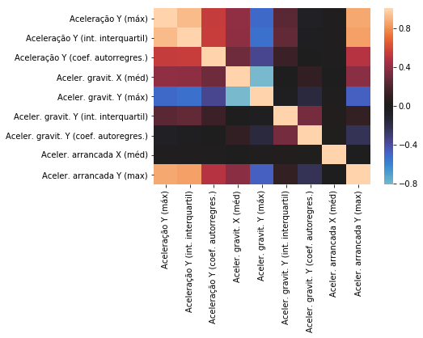

# Nanodegree Engenheiro de Machine Learning
## Projeto final - Reconhecimento de Atividades Usando Dados de Smartphone

Renato Rosafa Gavioli 

03 de agosto de 2018

## I. Definição

### Visão geral do projeto

A evolução da pirâmide etária brasileira vem apontando para um gradual envelhecimento da população. Este envelhecimento, caracterizado por um aumento na quntidade de idosos na população, é decorrente do crescente grau de urbanização do desenvolvimento econômico e humano do país [https://www.ibge.gov.br/apps/populacao/projecao/, acesso em 09.07.2018].

Idosos são frequentemente vítimas de quedas. Além dos problemas médicos, as quedas apresentam custo social, econômico e psicológico enormes, aumentando a dependência e a institucionalização. Estima-se que há uma queda para um em cada três indivíduos com mais de 65 anos e, que um em vinte daqueles que sofreram uma queda sofram uma fratura ou necessitem de internação. Dentre os mais idosos, com 80 anos e mais, 40% caem a cada ano. Dos que moram em asilos e casas de repouso, a freqüência de quedas é de 50%. A prevenção de quedas é tarefa difícil devido a variedade de fatores que as predispõem.[http://bvsms.saude.gov.br/bvs/dicas/184queda_idosos.html, acesso em 09.07.2018]

Com o advento e a democratização de _smartphones_ dotados de inúmeros sensores [https://www.uni-weimar.de/kunst-und-gestaltung/wiki/images/Zeitmaschinen-smartphonesensors.pdf, acesso em 09.07.2018], surgiram diversas aplicações de sensoreament que fazem uso destes sensores e das capacidades de processamento e transmissão dos _smartphones_, para aquisição e processamento de dados, exibição e comunicação.

O monitoramento e análise dos dados proveniente de sensores inerciais como acelerômetros e giroscópios podem permitir prever qual o padrão de atividade e movimentação do usuário, utilizando um algoritmo de classificação supervisionada. Com isso, torna-se possível a criação de aplicações para identificar uma queda em um idoso, permitindo ações de socorro mais rápidas, além de um cenário mais claro da distribuição de quedas, suas causas e contextos como subsídio para ações preventivas. Este tipo de estratégia já vem sendo aplicada para identificação de crises epilépticas [https://www.researchgate.net/profile/Khaled_Elleithy/publication/322921138_Smart_Phone_Application_Development_for_Monitoring_Epilepsy_Seizure_Detection_based_on_EEG_signal_Classification/links/5a76327145851541ce588920/Smart-Phone-Application-Development-for-Monitoring-Epilepsy-Seizure-Detection-based-on-EEG-signal-Classification.pdf?origin=publication_list, acesso em 09.07.2018].

Deste modo, o objetivo deste projeto foi treinar um algoritmo capaz de identificar de forma automática a queda de um indivíduo, a partir de dados obtidos de sensores inerciais presentes em um _smartphone_.

### Descrição do problema

O problema a ser resolvido é um problema de classificação supervisionada. 

Dada uma observação ou um conjunto de observações provenientes de acelerômetros e sensores de um smartphone, necessitamos saber qual a categoria de atividade/movimentação praticada pelo usuário daquele smartphone com algum grau de certeza.

Para o projeo foram utilizados os dados _Human Activity Recognition Using Smartphones Data Set_ (disponíveis em [https://archive.ics.uci.edu/ml/datasets/human+activity+recognition+using+smartphones] e em [https://www.kaggle.com/uciml/human-activity-recognition-with-smartphones].

Este conjunto foi produzido por um experimento no qual diversos voluntários praticaram diversas atividades com um aparelho preso à cintura - as informações geradas pelos acelerômetros foram preprocessadas e disponibilizadas. O conjunto de dados compreende cerca de 10000 observações de 561 caraterísticas (features), relacionadas a 7 atividades diferentes (`WALKING, WALKING_UPSTAIRS, WALKING_DOWNSTAIRS, SITTING, STANDING, LAYING`). 

Em face do objetivo principal de detecção de quedas, o problema pode ser simplificado quando tratado como um problema de classificaçao binária: foi tomada como atividade alvo a de deitar (`LAYING`), que pode corresponder a uma queda, e as demais foram agregadas, representado uma situação na qual não haja queda.

As características compreendem dados de acelerômetro e giroscópio em 3 direções. Os dados são fornecidos já preprocessados de modo que, dentre as características, estao máximos, mínimos, médias e dados convertidos em termos de aceleração, aceleração gravitacional, energia - uma boa parte destes features são de certo modo relacionados, podendo ser reduzidos para simplificar ainda mais o problema.

Após a redução de variáveis, e agregação das categorias em duas (classificação binária), os dados foram alimentados a diversos algoritmos de classificação supervisionadas, cujas métricas foram avaliadas para que fosse escolhido o modelo algoritmico de melhor desepenho para o problema.

A solução foi produzida com uso de software livre (Python e bibliotecas Pandas, Numpy e SKLearn), bem como dados abertos.

### Métricas

Podemos medir o quão bem resolvemos este problema a partir das taxas de acertos.

Para este problema, uma situação de não-queda que seja apontada como queda (falso positivo) não deve ser relevante, podendo ser desconsiderada pelo usuário. Já um falso negativo é extremamente indesejado, pois poderá resultar no usuário em situação de queda, sem que haja predição desta situação e eventual notificação.

Deste modo, o número de falsos positivos não deveria ser um problema, e a métrica principal de revocação (recall), e não de precisão, torna-se mais apropriada:

- revocação (recall), isto é, a razão entre o total de positivos verdadeiros, e o total de ocorrências positivas.
- acurácia, isto é, razão entre total de acertos (positivos verdadeiros e negativos verdadeiros) e toda a população;

A baixa tolerância a falsos negtivos motivou a não utilização do escore F1, que poderia ser resultante de uma precisão elevada e revocação baixa.

Como terceira métrica suplementar os tempos necessários para teste e treino, posto que um sistema destes deveria ser pouco exigente computacionalmente,  o bastante para possibilitar monitoramento e respostas em tempo real.

## II. Análise

### Exploração dos dados

Os dados foram carregados do _website_ e carregados no programa de análise, utilizando a IDE Jupyter.

Os dados já foram fornecidos separados em um conjunto de treino e um conjunto de testes, com 7352 e 2947 observações, respectivamente.

Cada conjunto de dados é compreendido por 563 colunas, sendo 561 variáveis contínuas - dados provenientes de acelerômetros com valores compreendidos no intervalo entre -1 e 1. Estas variáveis representam máximos, mínimos e médias de aceleração linear e angular em três direções, X, Y e Z, além de variáveis possivelmente derivadas como energia nas diferentes direções, ângulos, frequências...

Além destas variáveis, há duas variáveis discretas no conjunto: uma numérica que representa os diversos voluntários que praticaram as atividades na construção do conjunto de dados - esta variável foi retirada dos conjuntos para o treino do algoritmo.

Finalmente, uma variável discreta que representa as diversas atividades praticadas pelos volutários. 

A ocorrência de cada uma destas atividades nas observações é razoavelmente equilibrada nos dois conjuntos de dados, de treino e de teste.

Atividade|Contagem (treino)|Contagem (teste)
:---|---:|---:
LAYING                |1407 | 537
SITTING               |1286 | 491
STANDING              |1374 | 532
WALKING               |1226 | 496
WALKING_DOWNSTAIRS    | 986 | 420
WALKING_UPSTAIRS      |1073 | 471


### Visualização exploratória

Para se ter ideia do perfil geral dos dados, foi plotada uma matriz de gráficos de dispersão de algumas variáveis, tomadas ao acaso.


Para esta pequena amostra das variáveis, a maior parte delas parece ser normalmente distribuída. Ademais, é possível suspeitar alguma correlação entre alguns pares de variáveis.

Foi criado um mapa de calor dos índices de correlação entre algumas variáveis, que é mostrdo a seguir. Em preto são mostrados os valores próximos de zero, e em azul ou vermelho os valores negativos ou positivos, se aproximando da cor branca quão mais afastados do valor central zero.



O gráfico confirma a suspeita de que as variáveis são em geral altamente correlacionadas. De fato, se calcularmos a média dos valores absolutos dos índices de correlação de todos os pares de variáveis, o valor resultante é 0.418. 

Estes dados motivam um trabalho de engenharia de características para reduzir o número de variáveis, dado que a informação rpesente nelas provavelmente pode estar presente em diversas variáveis simultaneamente.

### Algoritmos e técnicas

Para a resolução do problema de identificação de quedas, a variáveil-alvo `'Activity'` foi processada, consolidando todas as demais categorias que não são `'LAYING'` numa categoria `'NOT_LAYING'`, de modo a simplificar o problema tornando-o um caso de classificação binária.

Em seguida, utilizei a técnica de análise de componentes principais (PCA), para reduzir o número de variáveis e simplificar ainda mais o problema, dada a evidente correlação entre diversas variaveis.

Finalmente, foram treinados 4 classificadores: regressão logística, _support vector machine_ (SVC), _naivebayes_ e _K-nearest neighbors_. Estes 4 algoritmos são simples e capazes de lidar com problemas de classificação binária. 

Para avaliação do desempenho dos classificadores, foram utilizadas métricas de acurácia e de revocação (recall), além dos tempos necessários para processamento dos dados de treino e para realização das previsões.

A implementação foi feita utilizando a biblioteca _sklearn_.

### Benchmark

Dentre os _kernels_ disponíveis no Kaggle para os dados avaliados, o mais votado (disponível em [https://www.kaggle.com/morrisb/what-does-your-smartphone-know-about-you]) descreve um modelo de aprendizagem com acurácia de 0.9557.

Com as simplificações propostas - classificação binária e engenharia de características com PCA - buscou-se uma acurácia maior que 0.9557, ainda que para uma solução menos generalizável que a implementada no Kernel referenciado.

## III. Metodologia

### Pré-processamento de dados

A base de dados utilizada passou por uma etapa de preprocessamento bastante simples.

Inicialmente, cada um dos dois conjuntos de dados, `dt_train` e `dt_test`, foi processado de modo a dar origem a outros dois conjuntos cada, resultando em 4 dataframes: `X_train`, `y_train`, `X_test` e `y_test`.

Os conjuntos `y_train` e `y_test` foram construídos apenas com a coluna de variável alvo `'Activity'`, a qual foi processada de modo a consolidar todas as categorias presentes em apenas duas: `'LAYING'` ou `'NOT_LAYING'`.

Os conjuntos `X_train` e `X_test` foram construídos com as colunas referentes a todas as demais variáveis, à exceção da variável alvo `'Activity'` e da variável `'subject'`, que foi removida por se tratar de informação pouco relevante à análise - não queremos que informações sobre cada indivíduo 'vazem' para nossa classificação.

Em seguida, tendo em vista a elevada correlação entre diversos pares de variáveis, foi aplicada ao conjunto de treinamento `X_train` uma análise de componentes principais, com o objetivo de simplificar o problema, mitigando eventuais dificuldades relacionadas à complexidade do modelo, decorrente da chamada _maldição da dimensionalidade (curse of dimensionality)_.

O algoritmo PCA foi aplicado para 50 variáveis componentes - este valor foi determinado empiricamente, sendo o resultado de uma exploração que buscou obter uma quantidade significativa de variância total dos dados explicada pelas componentes. Os 50 componentes obtidos foram capazes de explicar cerca de 0.93 da variância dos dados. A variância relativa de cada componente é mostrada na tabela a seguir.

Componente|Explained variance ratio
---:| ---:|
0|	0.625544
1|	0.049130
2|	0.041215
3|	0.018750
4|	0.016949
5|	0.012721
6	|0.011767
7|	0.010690
8	|0.009694
9|	0.008580
10|	0.007623
11|	0.006724
12|	0.005794
13|	0.005579
14|	0.004989
15|	0.004749
16|	0.004672
17|	0.004316
18|	0.004257
19|	0.004104
20|	0.003940
21|	0.003753
22|	0.003524
23|	0.003394
24|	0.003321
25|	0.003194
26|	0.003018
27|	0.002918
28|	0.002896
29|	0.002819
30|	0.002767
31|	0.002634
32|	0.002553
33|	0.002359
34|	0.002307
35|	0.002236
36|	0.002229
37|	0.002103
38|	0.002084
39|	0.002048
40|	0.001928
41|	0.001889
42|	0.001812
43|	0.001795
44|	0.001723
45|	0.001601
46|	0.001569
47|	0.001565
48|	0.001527
49	|0.001500

Foram inspecionadas as 20 características de maiores contribuições para a primeira componente principal:

Característica | Contribuição
--- | ---:
fBodyAccJerk-entropy()-X	|0.125230
fBodyAccJerk-entropy()-Y	|0.122470
tBodyAccJerkMag-entropy()	|0.120568
fBodyAcc-entropy()-X	|0.120216
fBodyAccMag-entropy()	|0.113367
tBodyGyroJerkMag-entropy()	|0.112255
fBodyBodyAccJerkMag-entropy()|	0.112088
fBodyAcc-entropy()-Y	|0.110593
tGravityAccMag-entropy()|	0.107665
tBodyAccMag-entropy()	|0.107665
fBodyAccJerk-entropy()-Z|	0.107166
tBodyAccJerk-entropy()-X|	0.106156
fBodyBodyGyroJerkMag-entropy()|	0.104365
tBodyAccJerk-entropy()-Y|	0.103868
fBodyAcc-entropy()-Z	|0.102172
fBodyGyro-entropy()-Y	|0.100928
tBodyAccJerk-entropy()-Z|	0.100456
fBodyGyro-entropy()-Z	|0.099746
fBodyBodyGyroMag-entropy()|	0.099734
fBodyGyro-entropy()-X	|0.099672

As características de maior contribuição são as de caráter de entropia relacionadas à aceleração e arrancada (jerk), que é a variação instantânea da aceleração.

Após a análise de componentes principais, ambos os conjuntos de características de treino e teste (`X_train` e `X_test`) foram transformados.

Para se ter uma ideia da eficácia da transformação, foi criado um mapa de calor semelhante ao criado na anális exploratória, o qual é mostrado a seguir. Os índices de correlação entre as variáveis componentes obtidas é sempre muito próxima de zero.


Não foi preciso binarizar caractrísticas categóricas nem qualquer tipo de limpeza de dados inconsistentes ou outliers.

### Implementação

Como já descrito anteriormente, foram escolhidas como métricas principais a acurácia e revocação. Estas métricas foram calculadas de forma a comparar:
- os dados de treino e suas respectivas previsões
- os dados de teste e suas respectivas previsões

Para cálculo das métricas, foram utilizadas as funções disponibilizadas pela biblioteca `sklearn.metrics`. 

Foram avaliados 4 algoritmos simples de treinamento, a saber:
- Regressão logística (`LogisticRegression`)
- Naive bayes (`GaussianNB`)
- Support vector machine (`SVC`)
- k-nearest neighbors (`KNeighborsClassifier`)

Os quatro algoritmos são prontamente aplicáveis para problemas de classificação binária como o que estamos lidando. 

As etapas de treino e de teste (predição) foram cronometradas para cada algoritmo, resultando num indicador suplementar de performance.

Os resultados da aplicação são mostrados na tabela a seguir:

clf name		|accuracy test	|accuracy train |recall test	|recall train	|train time  |predict time
:---|---:|---:|---:|---:|---:|---:|
LogisticRegression	|1.000000	|1.000000 |1.000000	|1.000000	|0.073148	|0.000000	
SVC	|1.000000	|0.999728	|1.000000	|1.000000	|0.102362	|0.030003
KNeighborsClassifier	|0.999321	|0.999592		|0.996276	|1.000000	|0.022016|0.502816
GaussianNB	|0.999321	|0.994967	|1.000000	|0.996446	|0.012022|0.003997

Foram obtidos resultados notáveis nesta etapa do projeto, particularmente com o algoritmo de regressão logística, que obteve desempenho igual a 1.0 para ambas métricas de desempenho.

Não foram encontrados problemas maiores na implantação do código. A redução de dimensionalidade foi capaz de reduzir a complexidade domodelo de modo suficiente, e não foi necessário nenhum tipo de processamento adicional dos dados já que a totalidade das características são numéricas contínuas.

### Refinamento

Era planejado o uso de uma estratégia de aprimoramento do melhor algoritmo obtido, através da aplicação de busca em matriz e otimização de hiperparâmetros para o algoritmo de maior desempenho em relação a acurácia e revocação. No entanto, o desempenho notável obtido, com scores de 1.0 para ambas acurácia e recall, tornam desnecessário qualquer refinamento de hiperparâmetros - estes índices indicam a inexistência de quaisquer observações classificadas errôneamente, como confirmado na matriz que é apresentada na próxima seção.

## IV. Resultados

### Modelo de avaliação e validação

O modelo final foi treinado num conjunto de dados compreendido por 7352 observações, e testado para avaliar sua robustez em um subonjunto de dados de teste com 2947 observações. 

Os resultados para esta rodada de testes são mostrados na matriz de confusão a seguir, mostrando-se razoável em suas respostas e alinhado com as expectativas de solução.

||LAYING verdadeiro|NOT_LAYING verdadeiro|
|---|---:|---:|
|**Previsto LAYING**|537 | 0|
|**Previsto NOT_LAYING**|0 | 2410|

O modelo final obtido foi um modelo de regressão logística com os hiperparâmetros `{'C': 1.0, 'class_weight': None, 'dual': False, 'fit_intercept': True, 'intercept_scaling': 1, 'max_iter': 100, 'multi_class': 'ovr', 'n_jobs': 1, 'penalty': 'l2', 'random_state': None, 'solver': 'liblinear', 'tol': 0.0001, 'verbose': 0, 'warm_start': False}`.

Os coeficientes obtidos para o modelo são listados a seguir:

```
lr.coef_ = [[ 0.4278084 , -0.48216185, -3.48114521,  0.66226565,  0.62032767,
         0.59808414, -0.7030771 , -0.40759882, -0.23849655,  0.37170711,
         0.91723785,  0.09594431, -0.80197278, -0.48312219, -0.4091375 ,
         0.06993872,  0.45918652,  0.26403763, -0.39250402,  0.01451421,
         0.22729588, -1.68330745, -1.0570208 , -0.56027822, -0.69681163,
         0.87791375,  0.10410775,  0.68379368,  0.43910915, -0.23368687,
        -0.80163596, -1.08668539, -0.15665158, -0.79911478,  0.25407517,
         0.0867431 , -0.15247749,  0.09771374,  0.07835925, -0.44980876,
         0.69490755,  0.03079006,  0.47693241, -0.40207427, -0.92107115,
         0.39244203,  0.48758815, -1.0780021 , -0.11453316,  0.17013243]]

lr.intercept_ = [4.79964236]
```

### Justificativa

A solução final do modelo desenvolvido aparenta apresentar desempenho que supera o do modelo de referência (acurácia 1.0 em relação a 0.95). Este tipo de comparação talvez não possa ser feita diretamente, dado que a solução aqui apresentada baseia-se em uma série de preprocessamentos que tornam o problema razoavelmente mais simples - trata-se de um problema de classificação binária, e não de classificação multiclasse como o modelo de referência citado.

Os resultados obtidos pelo modelo são significativos para a resolução do problema dentro de certos limites: os dados utilizados para sua construção foram obtidos num ambiente controlado, e o comportamento do modelo pode não ser o mesmo em uma situação real. Dito isso, ainda há bastante espaço para otimização de hiperparâmetros, sendo o resultado deste trabalho um primeiro passo na direção de desenvolver um modelo preditivo de queda.


## V. Conclusão

### Foma livre de visualização

Inicialmente, foi realizada uma tentativa de exibir a fronteira de decisão do modelo treinado, com um gráfico adaptado de [https://stackoverflow.com/questions/28256058/plotting-decision-boundary-of-logistic-regression].

As previsões foram calculadas a partir de probabilidades geradas num grid linear para as duas primeiras componentes principais, e para as demais componentes utilizei valores iguais a zero, considerando que as médias para as componentes estão todas em torno de zero (devido à PCA), e assim eu poderia centralizar a projeção bidimensional nas duas primeiras componentes em torno da origem.


O resultado obtido é mostrado no gráfico acima, porém não foi possível projetar a fronteria de decisão no plano bidimensional.

Encontrei um artigo que sugere o uso de retículos Voronoi para estimar a froneira de decisão[http://dare.uva.nl/document/2/164710], mas achei que seria um trabalho além do escopo pretendido aqui.

Finalmente, decidi utilizar uma transformação TSNE (t-distributed Stochastic Neighbor Embedding), para reduzir as 50 componentes principais para 2, e assim fazer um mapa bidimensional dos dados. 


No gráfico, é possível ver os clusters de pontos em azul, representando as ocorrências de `'LAYING'`, e clusters em vermelho mostrando os demais dados. A visualização demonstra como as categorias podem ser prontamente separadas mediante a aplicação de algoritmos. Pela visualização é também possivel observar outros agrupamentos dentre os pontos vermelhos, provavelmente representando as diferentes atividades que compõe a categoria `'NOT_LAYING'` - estes dados provavelmente poderiam ser separáveis, caso fosse este o objetivo.

### Reflexão

Para a resolução do problema, a primeira etapa foi explorar os dados - as características dos mesmos posibilitaram ter _insights_ importantes sobre as características das variáveis: se era necessária alguma limpeza nos dados, quais poderiam ser eliminadas imediatamente, como a característica alvo poderia ser tratada e consolidada para simplificar o problema, e se seria necessária uma estratégia de redução de dimensionalidade. 

Em seguida, foi realizada uma etapa de enenharia de características, composta principalmente por análise de componentes principais. Com essa análise, foi possível reduzir significativamente o número de características, simplificando ainda mais o problema.

Finalmente, foram treinados alguns algoritmos de aprendizagem, os quais foram avaliados com relação às métricas escolhidas, sendo escolhido o de melhor desempenho. Era prevista uma etapa de otimização de hiperparâmetros com a técnica de busca em matriz, porém esta etapa não foi realizada.

O aspecto mais interessante do projeto foi o preprocessamento dos dados, no qual o entendimento sobre as relações entre as variáveis possibilitou que eu agisse de forma deliberada na engenharia de característica e remoção de variáveis. Achei extremamente gratificante me sentir com desenvoltura para usar este tipo de ferramenta (PCA particularmente), e a relevância dos resultados obtidos por elas.

Tive dificuldade em tentar entender o significado físico das componentes principais obtidas após a PCA - as componentes podem agregar variáveis com significados físicos e até unidades de medida diferentes...! 

Outra dificuldade que senti foi em 'aceitar' os resultados dos modelos com acurácia e revocação iguais a 1.0 - esperava valores menores que 1.0, que permitissem otimização de hiperparâmetros. Acredito que, com um conjunto de dados maior ou mais 'sujo', estes escores tão elevados seriam menos prováveis. No entanto, ao repensar as etapas prévias de engenharia de características e simplificação do problema, acabei por aceitar o resultado.

Uma terceira dificuldade minha foi com a criação de gráficos e uso da biblioteca `matplotlib` - ainda não me entendi muito bem com essa ferramenta, a documentação parece confusa demais... Tenho uma lição de casa pra fazer com isso...

O modelo e a solução final alinham-se com as minhas expectativas de resolução para o problema. Porém, este tipo de abordagem foi particular para um problema de classificação binária bastante simples, e eu não acredito que pudesse ser utilizado de forma geral para outros problemas de classificação - outras estratégias podem ser necessárias para problemas de maior complexidade.

### Melhorias

Como já foi colocado, os resultados obtidos pelo modelo são significativos para a resolução do problema dentro de certos limites: os dados utilizados para sua construção foram obtidos num ambiente controlado, e o comportamento do modelo pode não ser o mesmo em uma situação real. Dito isso, ainda há bastante espaço para otimização de hiperparâmetros, sendo o resultado deste trabalho um primeiro passo na direção de desenvolver um modelo preditivo de queda.

Além disso, um aprimoramento poderia ser a construção de um modelo mais generalizável, em detrimento da simplificação do problema. 

Esta solução mais generalizável provavelmente viria a ser necessária conforme mais dados possam ser coletados e utilizados, que incluam:
 - dados coletados em situação real, e não por voluntários em ambiente controlado
 - dados relativos a outras atividades
 - transições entre diferentes atividades
 - atividades realizadas por indivíduos com diferentes condições de dificuldades motoras
 - dados de acelerometria de queda de indivíduos
  
Acredito que tal solução poderia utilizar outros modelos de aprendizagem, inclusive combinações de modelos (stacking) ou aprendizagem por reforço.

-----------
